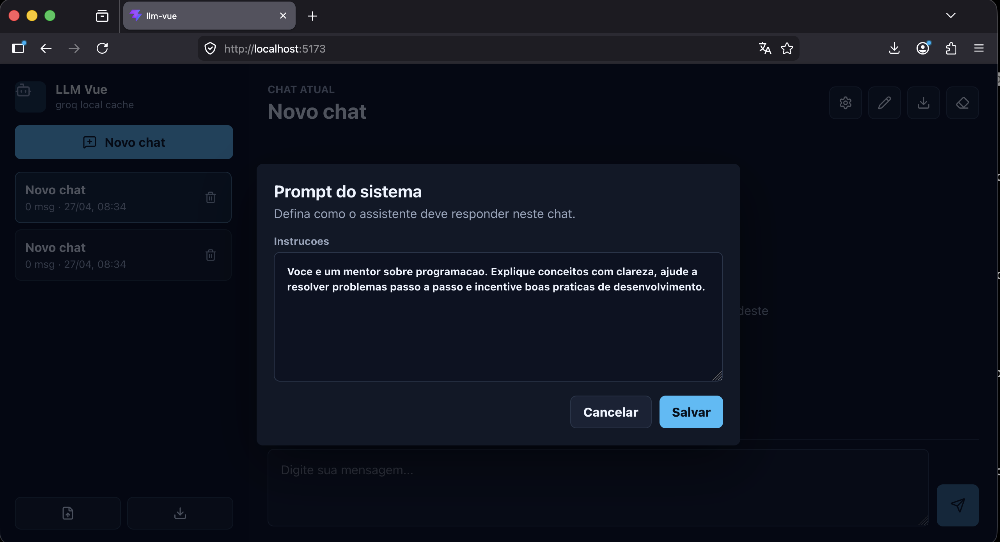
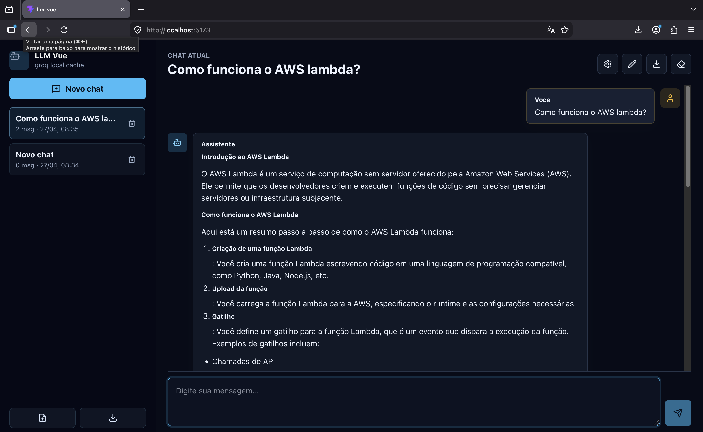

# LLM Vue1

SPA em Vue.js para conversar com um LLM usando Groq como provider inicial.

## Recursos

- Criar, alternar, renomear, limpar e excluir chats.
- Histórico salvo somente no cache local do navegador via `localStorage`.
- Exportar o chat atual ou todos os chats em JSON.
- Importar chats exportados em JSON.
- Editar o prompt de sistema em uma caixa dedicada por chat.
- Provider, URL base, modelo e chave configurados por `.env`.

## Configuracao

Edite o arquivo `.env`:

```env
VITE_LLM_PROVIDER=groq
VITE_LLM_BASE_URL=https://api.groq.com/openai/v1
VITE_GROQ_MODEL=llama-3.3-70b-versatile
VITE_GROQ_API_KEY=coloque_sua_chave_aqui
```

Como este projeto e uma SPA pura, variaveis `VITE_` ficam disponiveis no browser. Para ambiente de producao, use um backend/proxy para proteger a chave.

## Rodando

```bash
npm install
npm run dev
```

Build de producao:

```bash
npm run build
```
## Screenshots




